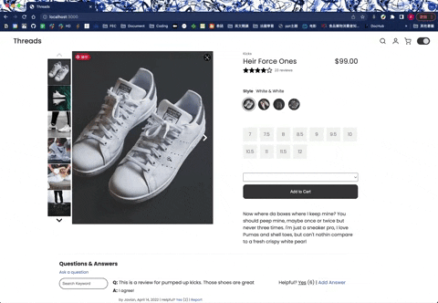
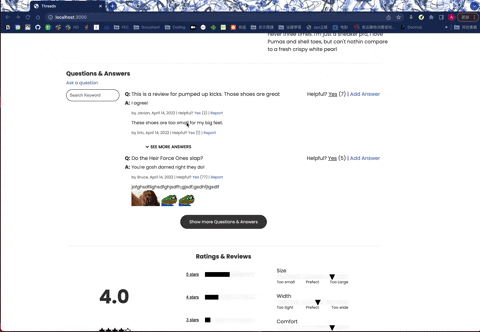
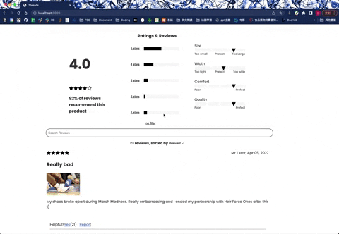

<div align="center">

# Threads

E-commerce activewear store website.

[Components](#getting-started) •
[Installation](#installation)

<!-- Gif of our page.  -->

</div>

## Components
### Product Overview


### Questions & Answers


### Reviews


## Installation
```
npm install
```
copy example.env file

### Installation


### Frontend 


### Backend


### Testing Enviroment:


### Deployment


## Contributors
### Amy Kwak
### Anny Wang
### Jake Gilfix
<!-- # Instructions for development

---

## Working on your branch

The [Feature Branch Workflow](https://www.atlassian.com/git/tutorials/comparing-workflows/feature-branch-workflow) assumes *one central repository* and the `main` branch represents the official project history.

Instead of committing directly to your local `main` branch, create a **new** branch to work on a **particular feature**. Feature branches should have *descriptive names* (e.g., "animated-menu-items").

Feature branches can (and *should*) be pushed to the central repository (on GitHub). The only *special* branch is `main`. **Don't ever push anything to** `main`! The following is a brief overview of how to do your work:

### 1. Start with the main branch

All feature branches are created off the latest code state of a project. Assume that the `main` branch on GitHub is always up-to-date. First, check out the `main` branch on your machine, pull the latest updates, and reset the repo's local copy of `main` to match the latest version:
```
git checkout main
git fetch origin
git reset --hard origin/main
```

### 2. Create a new feature branch

Use a **separate branch for each feature/issue you work on**. You can create a branch and check it out in one command as follows:
```
git checkout -b new-branch-name
```

### 3. Update, add, and commit changes

**On your feature branch**, you can edit, stage, and commit changes as usual.
```
git status
git add some_file
git commit -m "Some descriptive message--better messages help when we need to undo changes"
```

### 4. Push feature branch to remote (GitHub)

When ready, push your commits, updating the feature branch on GitHub. It's a good idea to push the feature branch up to the central repository so we can see what you're doing. To push `new-branch-name` to the central repository (GitHub), issue:
```
git push -u origin new-branch-name
```

**NOTE**: The `-u` flag adds the local branch you created in step 2 as a remote tracking branch. After setting up the tracking branch, `git push` can be invoked without any parameters to automatically push the `new-branch-name` branch to the central repo (GitHub).

### 5. Done implementing the feature? Create a pull request!

When you've finished implementing and testing the feature your branch was created to work on, create a pull request through GitHub.

## Running your code

1. Make sure you're working on the correct branch!

2. Open two terminal tabs and navigate to the root directory.

3. In one tab, run `npm start` to start the node server, which serves up static files from the /client/dist directory.

4. In the second tab, run `npm run react-dev`, which uses webpack to regenerate the `bundle.js` file when you save changes to one of your components.

5. Navigate to `localhost:3000` in your browser. -->

